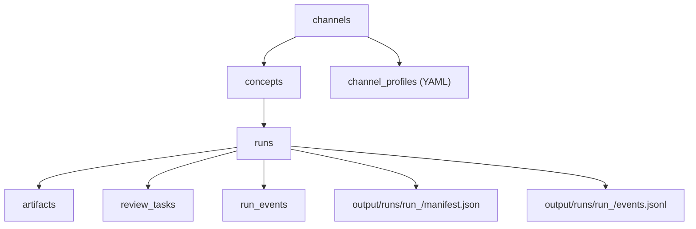

# YouTube Orchestrator — Local-First Refactor Plan

## Why This Refactor

The current system works, but it carries too many parallel workflow models for a tool that is primarily operated by one person on one machine:

- ideas exist in `concept_drafts`, `content_bank`, and `proposed_concepts`
- run state is split across database rows, asset records, subprocess status, and file sentinels
- image review uses `.images_approved` and `.images_denied` files
- channel behavior is spread across prompt files, builder registration, and hardcoded maps
- the frontend has overlapping review surfaces and a drifting API contract

That makes local iteration slower than it needs to be. The goal of this refactor is not to make the system more "enterprise." The goal is to make it easier to operate, debug, resume, and improve locally.

## Design Goals

1. One canonical model for a concept.
2. One canonical model for a run attempt.
3. Every run is durable, resumable, and inspectable.
4. Human review is explicit state, not hidden filesystem signaling.
5. Channel behavior is mostly config-driven.
6. The frontend is one operator console, not several loosely related admin pages.
7. The system still supports background automation, but manual desk-mode operation stays first-class.

## Non-Goals

- replacing FastAPI, React, or Postgres
- introducing distributed orchestration again
- building a generalized cloud worker system
- preserving every legacy endpoint or state model

## Target Architecture



### Core Entities

| Entity | Purpose | Notes |
|---|---|---|
| `channels` | Channel registry and stable identity | Keep existing table. |
| `concepts` | The single source of truth for ideas and production readiness | Replaces `concept_drafts`, `content_bank`, and `proposed_concepts`. |
| `runs` | One attempt to generate or publish a concept | Replaces the workflow meaning currently split across `content_runs` and parts of `content_bank`. |
| `artifacts` | Structured record of produced files and machine-readable outputs | Replaces `assets` with tighter typing. |
| `review_tasks` | Human-in-the-loop approvals and rejections | Replaces file sentinels and ad hoc review payloads. |
| `run_events` | Append-only structured event log | Replaces overloaded `log_entries` and vague `current_step` semantics. |
| `channel_profiles` | Per-channel config files | Replaces most hardcoded strategy maps and prompt-mode switches. |

## Proposed Data Model

### `concepts`

One row per idea, regardless of whether it was generated automatically or entered manually.

Suggested fields:

| Column | Type | Purpose |
|---|---|---|
| `id` | bigint | Primary key |
| `channel_id` | bigint | FK to `channels` |
| `origin` | text | `auto`, `manual`, `imported` |
| `status` | text | `draft`, `approved`, `queued`, `running`, `blocked`, `ready`, `published`, `failed`, `rejected`, `archived` |
| `form_type` | text | `short`, `long`, `meme`, `mid` |
| `title` | text | Operator-facing title |
| `concept_json` | jsonb | Full concept payload, including narration, scenes, and metadata |
| `notes` | text | Operator notes |
| `priority` | int | Queue priority |
| `latest_run_id` | bigint nullable | Last active attempt |
| `published_run_id` | bigint nullable | The run that actually got published |
| `created_at` | timestamptz | Audit |
| `updated_at` | timestamptz | Audit |

### `runs`

One row per attempt to generate, review, or publish a concept.

Suggested fields:

| Column | Type | Purpose |
|---|---|---|
| `id` | bigint | Primary key |
| `concept_id` | bigint | FK to `concepts` |
| `channel_id` | bigint | Denormalized for filtering |
| `status` | text | `queued`, `running`, `blocked`, `succeeded`, `failed`, `cancelled` |
| `stage` | text | `prepare`, `script`, `narration`, `visual_plan`, `images`, `image_review`, `animation`, `assembly`, `qa`, `publish`, `done` |
| `trigger` | text | `manual`, `scheduler`, `retry`, `auto_upload` |
| `pipeline_mode` | text | `default`, `builder:<name>` |
| `attempt_number` | int | 1, 2, 3... |
| `resume_from_stage` | text nullable | Where a retry resumed from |
| `run_dir` | text | Absolute path to `output/runs/run_<id>` |
| `manifest_path` | text | Path to `manifest.json` |
| `error_summary` | text nullable | Short failure summary |
| `started_at` | timestamptz | Audit |
| `finished_at` | timestamptz nullable | Audit |

### `artifacts`

Typed outputs produced by a run.

Suggested fields:

| Column | Type | Purpose |
|---|---|---|
| `id` | bigint | Primary key |
| `run_id` | bigint | FK to `runs` |
| `kind` | text | `script`, `narration_audio`, `scene_image`, `scene_video`, `subtitle_file`, `thumbnail`, `final_video`, `publish_metadata`, `publish_result`, `qa_report` |
| `stage` | text | Stage that produced it |
| `path` | text | File path if materialized |
| `json_data` | jsonb | Structured content if not file-backed |
| `checksum` | text nullable | Change detection |
| `created_at` | timestamptz | Audit |

### `review_tasks`

Explicit approval state for pauses in the pipeline.

Suggested fields:

| Column | Type | Purpose |
|---|---|---|
| `id` | bigint | Primary key |
| `run_id` | bigint | FK to `runs` |
| `kind` | text | `images`, `script`, `qa`, `publish` |
| `status` | text | `pending`, `approved`, `rejected`, `superseded` |
| `payload_json` | jsonb | What the operator is reviewing |
| `resolution_json` | jsonb | Feedback, overrides, replacements |
| `created_at` | timestamptz | Audit |
| `resolved_at` | timestamptz nullable | Audit |

### `run_events`

Append-only event stream for progress, logs, warnings, and structured decisions.

Suggested fields:

| Column | Type | Purpose |
|---|---|---|
| `id` | bigint | Primary key |
| `run_id` | bigint | FK to `runs` |
| `ts` | timestamptz | Event timestamp |
| `level` | text | `debug`, `info`, `warning`, `error` |
| `event_type` | text | `stage_started`, `stage_finished`, `artifact_created`, `review_requested`, `review_resolved`, `publish_succeeded`, `publish_failed` |
| `stage` | text nullable | Related pipeline stage |
| `message` | text | Human-readable summary |
| `data_json` | jsonb | Structured payload |

## Filesystem Contract

Keep using the local filesystem, but make it an explicit contract rather than a side effect.

```text
output/
  runs/
    run_1450/
      manifest.json
      events.jsonl
      concept_snapshot.json
      channel_profile_snapshot.yaml
      stages/
        01_prepare.json
        02_script.json
        03_narration.json
        04_visual_plan.json
        05_images.json
        06_image_review.json
        07_animation.json
        08_assembly.json
        09_publish.json
      artifacts/
        audio/
        images/
        video/
        subtitles/
        metadata/
```

### `manifest.json`

Each run should snapshot:

- concept input at run start
- channel profile version used
- pipeline mode and builder name
- prompt/model versions
- stage status
- artifact inventory
- review decisions
- timings
- estimated API usage and cost

The manifest becomes the local source of truth for resume, retry, and analysis.

### `events.jsonl`

Mirror `run_events` into a JSONL file so a run folder remains useful even if the database row is missing, stale, or manually inspected outside the app.

## Worker Model

The local-first worker should be simpler than the current distributed-style queue logic.

### Principles

- one dispatcher process
- configurable concurrency, default `1`
- subprocess per run is fine
- resume from checkpoints instead of reusing arbitrary old files
- no file-sentinel review coordination

### Execution Flow

1. Select the next `concepts.status = 'queued'`.
2. Create a `runs` row and `output/runs/run_<id>/`.
3. Snapshot the concept and channel profile into the run directory.
4. Execute stages in order, updating `runs.stage`, `run_events`, and `manifest.json`.
5. If a review is required, create a `review_tasks` row and set `runs.status = 'blocked'`.
6. On approval, resume the same run from the blocked stage.
7. On retry, create a new run that reuses only valid checkpointed artifacts.

### Stage Invalidation Rules

Retries should be deterministic:

- if the concept changes, invalidate all downstream stages
- if the prompt family changes, invalidate the affected stage and everything after it
- if a channel profile changes, invalidate all stages marked profile-sensitive
- if only publish metadata changes, do not regenerate media

## Channel Profiles

Move channel behavior into files under `channels/`.

Suggested layout:

```text
channels/
  13-munchlax-lore.yaml
  16-crabrave-shorts.yaml
  22-deity-drama.yaml
```

Suggested profile fields:

- `channel_id`
- `slug`
- `content_modes`
- `default_form_type`
- `builder`
- `prompt_family`
- `voice`
- `art_style`
- `thumbnail_policy`
- `review_requirements`
- `upload_policy`
- `scheduling`
- `cost_limits`

Only keep custom Python builders for truly custom assembly logic. Most channel differences should become data.

## API Surface

The current API should be simplified around concepts, runs, reviews, and live events.

### Concepts

- `GET /api/concepts`
- `POST /api/concepts`
- `GET /api/concepts/{id}`
- `POST /api/concepts/{id}/approve`
- `POST /api/concepts/{id}/reject`
- `POST /api/concepts/{id}/queue`
- `POST /api/concepts/{id}/clone`

### Runs

- `GET /api/runs`
- `GET /api/runs/{id}`
- `GET /api/runs/{id}/artifacts`
- `GET /api/runs/{id}/events`
- `POST /api/runs/{id}/retry`
- `POST /api/runs/{id}/resume`
- `POST /api/runs/{id}/cancel`
- `POST /api/runs/{id}/publish`

### Review Tasks

- `GET /api/review-tasks`
- `GET /api/review-tasks/{id}`
- `POST /api/review-tasks/{id}/approve`
- `POST /api/review-tasks/{id}/reject`

### Channels

- `GET /api/channels`
- `GET /api/channels/{id}`
- `GET /api/channels/{id}/profile`
- `POST /api/channels/{id}/profile/reload`

### Live Operator Updates

- `GET /api/events/stream` via Server-Sent Events

SSE should carry:

- run status changes
- new review tasks
- stage progress
- publish completion
- worker heartbeat

## Frontend Direction

Replace the current page split with one main operator console plus detail routes.

### Primary Screen

- left column: queue, filters, channels, review inbox
- center: selected concept or run
- right column: artifacts, structured logs, actions, publish tools

### Secondary Views

- channel settings
- run deep-dive
- metrics and postmortems

### Important UX Changes

- one shared image review component
- batch queue and retry actions
- "rerun from stage"
- "clone concept"
- "compare runs"
- live log stream via SSE instead of heavy polling

## Desk Mode vs Autopilot Mode

Because this is a local operator tool, the UI and worker should expose two explicit modes.

### Desk Mode

- manual concept generation
- manual review
- manual queueing
- manual publish
- minimal background behavior

### Autopilot Mode

- maintain concept inventory
- schedule queued concepts
- auto-upload when policy allows
- retry or alert on failure

`channel_schedules` can remain, but it should be treated as an optional automation layer rather than the center of the data model.

## Current-to-Target Mapping

| Current | Target |
|---|---|
| `concept_drafts` | `concepts` |
| `content_bank` | `concepts` queue fields and run linkage |
| `proposed_concepts` | merge into `concepts` with `origin = 'manual'` |
| `content_runs` | `runs` |
| `assets` | `artifacts` |
| `.images_approved` / `.images_denied` | `review_tasks` |
| `content_runs.log_entries` | `run_events` |
| hardcoded channel sets/maps | `channels/*.yaml` plus minimal builder registration |
| duplicated review pages | one shared review module |

## Migration Plan

### Phase 0 — Stabilize What Already Exists

- make the frontend build green
- normalize rendered video asset naming
- fix upload state transitions so run status and concept status stay aligned
- remove obviously dead reads like `youtube_upload` if they are truly unused
- fix async bugs and hidden exception paths in review endpoints

This phase should not change the product model yet. It only stops active drift.

### Phase 1 — Add `run_events` and Run Manifests

- add `run_events` table
- start writing `events.jsonl` and `manifest.json` for every new run
- update the pipeline to emit structured events
- keep existing tables, but make `run_events` the new debugging source of truth

This is the safest first structural win because it improves observability without forcing a full workflow rewrite.

### Phase 2 — Replace File-Sentinel Review

- add `review_tasks`
- create review tasks instead of writing `.images_approved` / `.images_denied`
- teach the worker to resume blocked runs when a task is resolved
- move the frontend review UI to the new endpoints

At the end of this phase, remove sentinel-file logic from builders and API routes.

### Phase 3 — Introduce `concepts`

- add new `concepts` table
- dual-write approved concepts from existing flows into `concepts`
- create a small compatibility layer so old routes still work temporarily
- start creating runs from `concepts` instead of `content_bank`

Once stable, freeze writes to `concept_drafts`, `content_bank`, and `proposed_concepts`.

### Phase 4 — Move Channel Strategy into Profiles

- create `channels/*.yaml`
- migrate hardcoded channel settings into profile files
- update concept generation and pipeline setup to read profile config
- keep builder modules only where custom scene assembly is genuinely needed

### Phase 5 — Rebuild the Frontend Around the New Model

- create one operator console view
- consolidate image review into one shared component
- switch polling-heavy pages to SSE plus targeted fetches
- generate or share API types so the frontend contract stops drifting

### Phase 6 — Delete Legacy Paths

- remove `concept_drafts` routes once replaced
- remove `content_bank` routes once replaced
- remove `proposed_concepts` usage
- remove `scheduled_uploads` if autopilot no longer needs it, or rebuild it on top of `concepts`
- remove old asset-type aliases after migration

## Recommended Implementation Order

If the goal is maximum local leverage with the least wasted work:

1. fix build drift and asset/upload inconsistencies
2. add run manifests and `run_events`
3. replace review sentinels with `review_tasks`
4. unify the concept model
5. move channel behavior into profile files
6. rebuild the frontend as one operator console

## What This Refactor Buys You

- fewer hidden states
- easier retries and postmortems
- simpler mental model for the queue
- easier channel experimentation
- less frontend churn
- cleaner path to both manual operation and background automation

The key idea is simple: make every run a durable local bundle, make workflow state explicit in the database, and stop representing important decisions as side effects scattered across tables, files, and one-off code paths.
